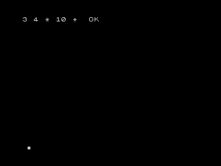
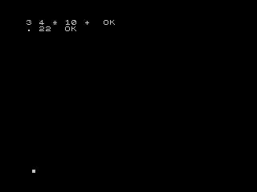
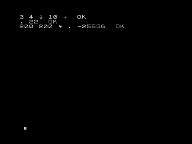
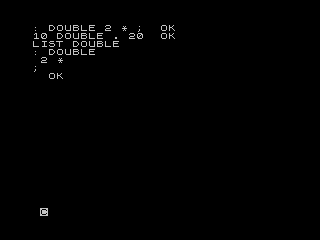
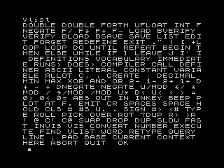
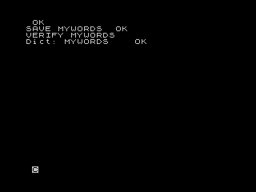

# Minstrel 4th Quick Start Guide

## Introduction

The Minstrel 4th stands out from many other micros, in that it ships with FORTH as its built-in language, rather than the otherwise ubiquitous BASIC. FORTH has several big advantages that make it a good match to the Minstrel. First, it is fast, and, in particular, it is much faster than BASIC. FORTH programs are compiled and interact with the hardware on a lower level than they do in BASIC, meaning it is not uncommon for a FORTH version of a program to run ten times faster than the BASIC equivalent. Second, a FORTH program is lean, using much less memory than its BASIC equivalent. This means you can write fast and compact programs for the Minstrel 4th, without having to resort to machine code.

However, FORTH has several idiosyncrasies that can deter those who are unfamiliar with the language. First, FORTH is a stack-based programming language. A stack is a relatively primitive data structure intended to provide temporary storage for a program. The programmer adds numbers to a stack in the same way a writer adds pages to a pile of paper. Numbers in a stack have to be accessed in a certain order; you can only access the entry on top of the stack, which is the most recent value added.  To get to numbers lower down the stack (a number you added earlier on), you have to take off the values above it (after it) first.

While a stack is primitive, it is much faster to access than program variables. In FORTH, data is (usually) passed to and from routines via the stack rather than as parameters or variables, something that can be confusing to the uninitiated. FORTH has a common notation for describing the state of the stack: the value on the top of the stack is called TOS and the next lower value on the stack is called 2OS.

Because the stack is so important in FORTH, the language relies heavily on Reverse Polish notation, in which parameters precede the procedures that act upon them. For example, in BASIC, you can set the print location on the screen using something like `AT 12, 14`. The equivalent expression in FORTH is `12 14 AT`. The parameters appear before the function (and there is no punctuation, other than spaces). 

If you can get past these idiosyncrasies, you will find that your Minstrel 4th gives you lots of scope to indulge your passion for micro-computing and to create useful and interesting programs.

## The FORTH Language


At the heart of Forth is a dictionary of procedures, referred to as words, which encapsulates the functionality of the computer. You can see a list of built-in words, in the Minstrel 4th, by typing the command `VLIST`. Looking at the list produced, there will probably be some words, such as `PLOT` and `BEEP`, for which their purpose seems obvious, but also many words for which it is not. In fact, words such as `.` and `:` may look more like punctuation than words. However, rest assured that they are words and it is important to remember that when writing FORTH. 

The syntax of FORTH is very simple, with programs being built up from sequences of (FORTH) words and numbers, separated by spaces. There is no other punctuation in FORTH other than space.

If you have the Minstrel powered up, you can type the following simple expression:

```
3 4 * 10 +
```

When you press Enter, the expression is copied to the upper part of the screen alongside the response 'OK', indicating success, but you will notice that no obvious answer is produced. 



The field near the bottom of the screen, where you enter commands, is called the Input Buffer. When you press Enter, the Minstrel looks to see what instructions are in the Input Buffer and processes them item by item. The first item it will come across in this case is the '3'. It will check to see if '3' is a word in its dictionary. It is not, so it will then try to interpret '3' as a number. This will succeed, so it will add 3 to the top of the stack (it will also move the item to the upper part of the screen, to indicate it has been processed).

The Minstrel then checks if there is anything else in the Input Buffer. It finds '4' and again will interpret this as a number. It will add '4' to the stack and move it to the top of the screen. The stack now contains two values '3' and '4' in positions 2OS and TOS, respectively.

The next item it finds is '*'. The Minstrel will search its dictionary and find a word named * that takes the top two items off of the stack, multiplies them together, and puts the answer back on the stack. The * will be echoed to the upper screen and the stack will now contain one value, 12.

Continuing on, it will add 10 to the stack and then execute the next word '+' which will add the top two number on the stack and replace them with the answer.

There are no more items in the Input Buffer, so the Minstrel prints 'OK' to indicate it has successfully processed all of the instructions it has been given.

But where is the answer, you say? The answer is on the stack. If you want to see the answer, you need to ask the Minstrel to print the value on the top of the stack and to do this you type the word `.` (that is, a full stop). This is another standard Forth word: it removes the top number from the stack and prints it on the screen. 



The above example is not exactly earth shattering, but it does explain how Forth processes commands. Having cut your teeth with Forth, you might now try the apparently similar expression:

```200 200 * .```

---which does not produce the answer you probably expected.



If you are familiar with machine code, you may spot immediately what has happened. If not, I will explain. Numbers on the Minstrel 4th are, by default held as 16-bit, signed integers, which can hold values between -32,768 and +32,767. If you happen to overflow this range (200 × 200 = 40,000, which is too big to fit in a 16-bit, signed integer), the answer will simply overflow and lose its most significant bit, leading to the wrong answer. However, the Minstrel will not tell you this has happened: It will happily compute and report the wrong answer. This is a potential downside of a language like FORTH. If you tried the same calculation in BASIC, it would have succeeded, though would have spent some time turning your inputs into its generic internal representation, consuming around five times as much memory and taking quite a bit longer to produce the answer. The trade-off for fast FORTH arithmetic is that it relies on the programmer being aware of and checking for its limitations. By the way, FORTH on the Minstrel can deal with bigger numbers (and floating-point numbers, too) though this requires the use of different words, which are best kept until you know some more FORTH.

## Writing Programs

A key advantage of FORTH is the ability to define your own words, to supplement the standard dictionary. FORTH programs are effectively words written by an end-user to encapsulate some function--anything from a platform arcade game through to a spreadsheet.

The easiest way to define a new word is by combining existing words. In this way, a program can be represented by a top-level word built up from other user-defined and internal words. This form of programming encourages a top-down approach and a large program could be made up of a number of layers of lower-level words.

To define a new word from other, existing words, you need to be aware of two FORTH words, `:` and `;` which switch FORTH between compile mode and interpret mode. Consider the following FORTH code
```
: DOUBLE 2 * ;
```
We have seen `*` earlier, but the other words are new to us. This is a very simple word definition, which creates a new word, named DOUBLE. The `:` command tells the Minstrel you want to define a new word and the word immediately after is the name of that new word. Following on from that is the body of the new word, which is interpreted whenever you enter DOUBLE, terminated by the `;` command, which returns FORTH to interpret mode. Note that because `:` and `;` are words, they need to be surrounded by spaces.



As you have probably guessed, DOUBLE multiplies something by two. However, as only one value (`2`) is added to the stack, within the word, this means that the other value needs to be on the stack already.

When you type the command above, the Minstrel will compile the new word into a fast, internal representation, ready to be used in the same way as other FORTH words.

You can see that your new word is part of the dictionary, using ``VLIST``. You should find that DOUBLE is the first word printed: it is at the top of the dictionary.

To test DOUBLE, you could enter something like:
```
10 DOUBLE . 
```
For words that you define, you can display the definition using the word `LIST`. Notice that the Minstrel will make an attempt to format the listing in an easy-to-read way. Notice, also, that `LIST` does not work for internal words: they are defined in a different way.

For this simple word, it is reasonably easy to work out what is going on, even if you come back to the word some weeks later. However, for more complicated words, it is useful to be able to add comments. To do this in FORTH, you use two words `(` and `)`, which indicate the beginning and end of a comment (though remember, they are words so need to be surrounded by spaces).

To update our word definition, for DOUBLE, we type `EDIT DOUBLE`. This will open the existing definition of DOUBLE in the input buffer and allow us to edit it, to something like:
```
: DOUBLE ( N -- 2*n ) 
  ( MULTIPLY VALUE ON STACK BY TWO )
  2 *
;
```
For longer word definitions, `EDIT` will divide the definition into sections of around 12 lines long. Once you have finished editing the current section, press Enter to move on to the next one. Pressing Enter in the last section will end the editing session. Sadly, you cannot go back to the previous section in an editing session, so, if you need to backtrack, you will have to skip through the remaining sessions and EDIT the word again (though you should read on before doing too much EDIT-ing).

You might naturally assume that the definition of DOUBLE has been updated, in the dictionary. However, this is not quite what happens. When the Minstrel exits the editing session, it creates a new word at the top of the dictionary, which is effectively an edited version of the old word (which is also still in the dictionary). You can see this by entering `VLIST`, which will confirm you have two copies of the word DOUBLE.



Having edited a word, it is important to remember immediately to replace the old version, using a word named REDEFINE--in this case, you would type `REDEFINE DOUBLE`. This will replace the old definition of DOUBLE by the word on the top of the stack (and also recompile any words that might depend on it).

The process for EDIT-ing and REDEFINE-ing words is a potential source of problems for someone new to the Minstrel 4th. If you forget to REDEFINE your word, you will end up having two copies and, worse still, if you go on to define more words, you will not be able to REDEFINE the earlier word, since REDEFINE expects the new definition to be at the top of the dictionary. In this case, the only solution is to use the word `FORGET` to remove all of the subsequent words and then use REDEFINE as you should have done originally.  Say, you had forgotten to REDEFINE DOUBLE, above, and, fuelled with enthusiasm, had gone on to write further words TRIPLE and QUADRUPLE. Then the top of your dictionary would look like:


To correct the issue, you would need to type the following:

```
FORGET TRIPLE ( FORGETS ALL WORDS AFTER AND INCLUDING TRIPLE )
REDEFINE DOUBLE ( CORRECT YOUR ORIGINAL OMISSION )
: TRIPLE 3 * ; ( I AM SURE I TYPED THIS BEFORE )
: QUADRUPLE 4 * ; ( YEP, DEFINITELY DEJA VU )
```

In this case, the error is not too costly. However, in longer programs, it could become a very expensive mistake to fix. Because of this, it is wise to save your work frequently, as we will explain below.

## Saving Your Work

When you turn the Minstrel 4th off, any new words you have defined will be wiped from memory. However, having spent time creating some new words, it is useful to be able to keep them for future use. To do this, in typical 1980s style, you need a cassette recorder (or a modern-day substitute, such as a PC with a mic jack). 

You need to connect your cassette recorder to the ear and mic sockets on the Minstrel 4th, using a 3.5mm headphone lead (contrary to the usual convention, the mic socket is used to capture audio output from the Minstrel, to save on tape, and the Ear socket is used to play-back a saved program into the Minstrel's memory).

To save your words, you use the word SAVE followed by the name you want to give your new extended dictionary--for example, `SAVE MYWORDS`. Before pressing Enter, you should press 'Record' on the cassette recorder, as the Minstrel 4th will immediately begin transmitting the data. It takes around 5 seconds per kilobyte to save your work.

Before powering off, it is worthwhile to check that you have saved your work successfully and, to do this, you use VERIFY. Rewind your tape to just before the saved session and enter `VERIFY MYWORDS`. You can then play back the saved audio, so that the Minstrel 4th can check it agrees with what is in memory.
Having successfully saved your work, you can load it back into memory, in a future session, using `LOAD MYWORDS`.



It is worth noting that the Minstrel 4th is hard of hearing. You will need to play back your save audio at a high volume (though, thankfully, you will not hear it, as it goes straight into the computer's Ear socket). In my experience, you should set a tape recorder to play-back at around three quarters of maximum volume (or, on a PC, full volume is likely to be needed). Trial and error is required to get a reliable process for saving and loading to cassette, so it is worthwhile to get to grips with this early on.

## Next steps

This is the end of your quick tour of the Minstrel 4th. However, there are lots of other resources available to help you take your next steps. 

The Minstrel 4th uses a variant of FORTH, called AceForth, developed for an early 1980s micro called the Jupiter Ace. The Minstrel 4th is a clone of the Ace and runs the same monitor and FORTH system as the Ace did. Software written for the Ace (and books about the Ace) should work on (and be relevant to) the Minstrel 4th. In particular, the original Ace user guide, called "Jupiter Ace FORTH Programming" by Steven Vickers, is an excellent book for learning to program the Minstrel 4th. It was recently re-printed to celebrate the Ace's 35th birthday, so is relatively easy to find on retro-computing auction sites. Further, along with lots of software and other materials, you can find a PDF copy of the user guide on the [Jupiter Ace archive website](www.jupiter-ace.co.uk).

Hopefully, you will go on to have a great deal of fun programming your Minstrel 4th, and to become a convert to the FORTH way. However, even if you do not, you will still be able to enjoy the wide range of software that others have written for the (Jupiter Ace and) Minstrel 4th. 

George Beckett, 20th May 2020
