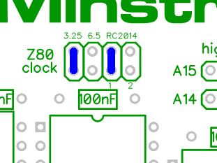

# Using the "YM2149 Sound Card for RC2014 Retro Computer" with Minstrel 4th

## Introduction

The ["YM2149 Sound Card for RC2014 Retro Computer"](https://www.tindie.com/products/semachthemonkey/ym2149-sound-card-for-rc2014-retro-computer/) can be plugged into the Minstrel 4th, via the RC2014 edge connector to boost the audio capabilities of the computer.

## Building the Card

Build the card following the instructions for the RC2014 computer, using the same jumper settings. The only jumper, on the sound card, that may need adjusting is the clock-divide setting (JP5). If you run your Minstrel 4th at 6.5 MHz then you should select divide-by-4 option. Whereas, if you run your Minstrel 4th at 3.25 MHz, you should select divide-by-2.

You also need to configure the Z80 Clock jumper on the Minstrel 4th board to pass through the clock signal to the RC2014 bus. Do this by shorting out pins 5 and 6 (labelled RC2014/1). You also need to connect either pins 1 and 2 (for 3.25 MHz clock) or pins 3 and 4 (for 6.5 MHz) clock.



## Testing the Card

Ed Brindley has created a repository of useful information and tools for the sound card on [GitHub](https://github.com/electrified/rc2014-ym2149), including a simple BASIC test script. A Forth version of this script, suitable for the Minstrel 4th, is as follows:

```
216 CONSTANT REG
208 CONSTANT DAT

DEFINER CODE DOES> CALL ;

CODE HALT 118 C, 253 C, 233 C,

: TEST
 7 REG OUT 62 DAT
 OUT 8 REG OUT 15
 DAT OUT 0 REG OUT
 BEGIN
  255 1
  DO
   I DAT OUT HALT
  LOOP
  0
 UNTIL ( INFINITE LOOP, BREAK TO EXIT )
;
```

You can also use S.V.Bulba's PT2/PT3 player, which is available from Ed Brindley's repository, to provide a more interesting test of the sound card.

Assemble the source code, using the RC2014 configuration (set `RC=1` at the beginning of the source). However, you also need to disable interrupts, by inserting the `DI` command immediately after the `ORG` directive. This is to work around the fact that they player makes extensive use of the IX register pair, which is also used by Minstrel 4th's built-in monitor program.

## Usage

To be provided.
